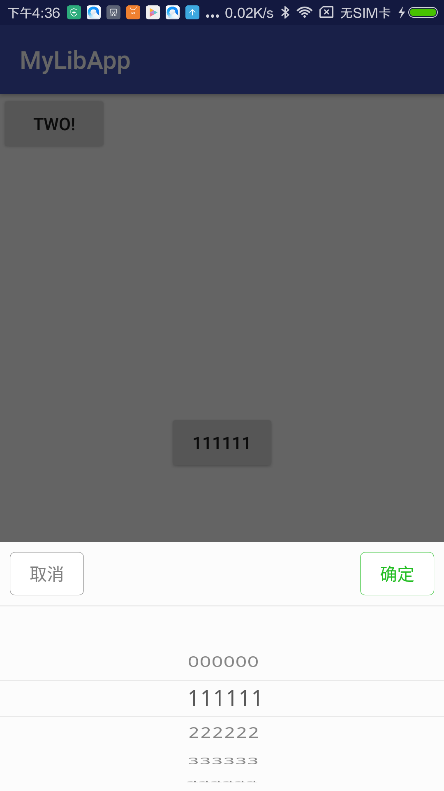
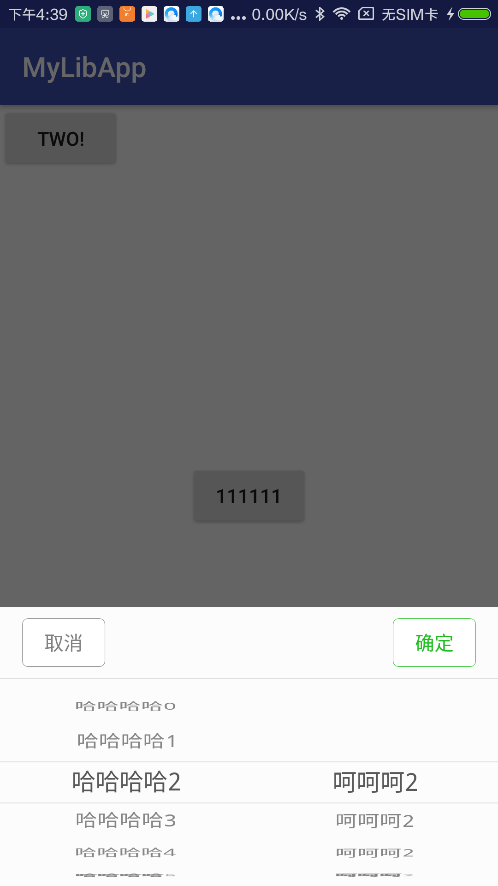
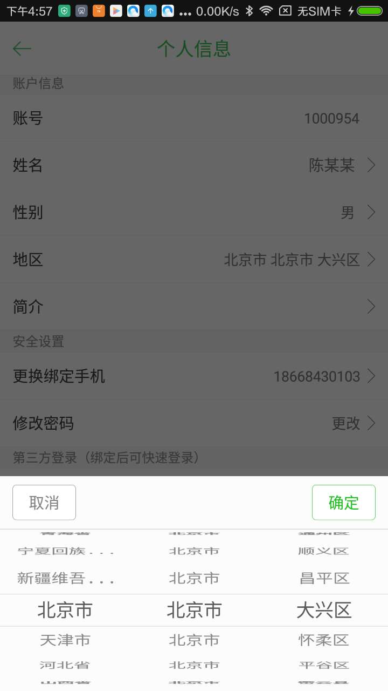

WheelView
=========





### How to use

#### layout:
```xml
dia_picker 单个whileview
dia_picker_time 多个whileview
```

#### Activity:

```java
单个：
   btn.setOnClickListener(new View.OnClickListener() {
            @Override
            public void onClick(View views) {
                if (null == dialog_profession) {
                    View view = LayoutInflater.from(MainActivity.this).inflate(R.layout.dia_picker, null);
                    dialog_profession = WhileViewUtil.getDialog(MainActivity.this, view, Gravity.BOTTOM, false);
                    wv = (WheelView) view.findViewById(R.id.wv);
                    TextView btnCancel = (TextView) view.findViewById(R.id.btnCancel);
                    btnCancel.setOnClickListener(new View.OnClickListener() {
                        @Override
                        public void onClick(View view) {
                            dialog_profession.dismiss();
                        }
                    });
                    final TextView btnSubmit = (TextView) view.findViewById(R.id.btnSubmit);
                    btnSubmit.setOnClickListener(new View.OnClickListener() {
                        @Override
                        public void onClick(View view) {
                            if (wv.isStop()) {
                                btn.setText(list.get(wv.getCurrentItem()));
                                dialog_profession.dismiss();
                            }
                        }
                    });
                    wv.setAdapter(new ArrayWheelAdapter(list));
                    wv.setCyclic(false);
                    wv.setOnItemSelectedListener(new OnItemSelectedListener() {
                        @Override
                        public void onItemSelected(int index) {
                            wv.setIsStop(true);
                        }
                    });
                    wv.setCurrentItem(0);
                }
                dialog_profession.show();
            }
        });

```
```java
多个：
  View view = LayoutInflater.from(MainActivity.this).inflate(R.layout.dia_picker_time, null);
                dialog_profession = WhileViewUtil.getDialog(MainActivity.this, view, Gravity.BOTTOM, false);
                wv_province = (WheelView) view.findViewById(R.id.wv_year);
                wv_city = (WheelView) view.findViewById(R.id.wv_month);
                wv_area = (WheelView) view.findViewById(R.id.wv_day);
                wv_area.setVisibility(View.GONE);
                TextView btnCancel = (TextView) view.findViewById(R.id.btnCancel);
                btnCancel.setOnClickListener(new View.OnClickListener() {
                    @Override
                    public void onClick(View view) {
                        dialog_profession.dismiss();
                    }
                });
                final TextView btnSubmit = (TextView) view.findViewById(R.id.btnSubmit);
                btnSubmit.setOnClickListener(new View.OnClickListener() {
                    @Override
                    public void onClick(View view) {
                        if (wv_province.isEnabled() && wv_city.isEnabled()) {
                            String place = listTwo.get(wv_province.getCurrentItem()).getMajname()
                                    + "(" + listChild.get(wv_city.getCurrentItem()).getMajname() + ")";
                            btns.setText(place);
                            dialog_profession.dismiss();
                        }
                    }
                });
                wv_province.setAdapter(new ArrayWheelAdapter(listTwo));
                wv_province.setCyclic(false);
                wv_province.setHide(true);
                wv_province.setOnItemSelectedListener(new OnItemSelectedListener() {
                    @Override
                    public void onItemSelected(int i) {
                        listChild.clear();
                        listChild.addAll(listTwo.get(i).getServiceList());
                        wv_city.setAdapter(new ArrayWheelAdapter(listChild));
                        wv_city.setCurrentItem(0);
                        wv_province.setEnabled(true);
                    }
                });
                wv_city.setAdapter(new ArrayWheelAdapter(listChild));
                wv_city.setCyclic(false);
                wv_city.setHide(true);
                wv_city.setOnItemSelectedListener(new OnItemSelectedListener() {
                    @Override
                    public void onItemSelected(int i) {
                        wv_city.setEnabled(true);
                        wv_province.setEnabled(true);
                    }
                });
                wv_province.setWv(wv_city, wv_area);
                wv_city.setWv(wv_province, wv_area);
                wv_area.setWv(wv_province, wv_city);

                wv_province.setCurrentItem(0);
                wv_city.setCurrentItem(0);
        dialog_profession.show();
```

#### 切记:

```java
如果是model 想显示哪个字段在whileview上记得映射
        private String id;
        private String majname;
        private ArrayList<ServiceModel2> serviceList;

        public String getId() {
            return id;
        }

        public void setId(String id) {
            this.id = id;
        }

        public String getMajname() {
            return majname;
        }

        public void setMajname(String majname) {
            this.majname = majname;
        }

        public ArrayList<ServiceModel2> getServiceList() {
            return serviceList;
        }

        public void setServiceList(ArrayList<ServiceModel2> serviceList) {
            this.serviceList = serviceList;
        }

        //这个用来显示在PickerView上面的字符串,PickerView会通过反射获取getPickerViewText方法显示出来。
        public String getPickerViewText() {
            //这里还可以判断文字超长截断再提供显示
            return majname;
        }
```
#### To get a Git project into your build:
```java
Step 1. Add the JitPack repository to your build file
    allprojects {
		repositories {
			...
			maven { url 'https://jitpack.io' }
		}
	}
Step 2. Add the dependency
    dependencies {
	        compile 'com.github.chenxinfei:WheelView:v1.0'
	}
```
License
=======

    Copyright 2017 Chen xinfei

    Licensed under the Apache License, Version 2.0 (the "License");
    you may not use this file except in compliance with the License.
    You may obtain a copy of the License at

       http://www.apache.org/licenses/LICENSE-2.0

    Unless required by applicable law or agreed to in writing, software
    distributed under the License is distributed on an "AS IS" BASIS,
    WITHOUT WARRANTIES OR CONDITIONS OF ANY KIND, either express or implied.
    See the License for the specific language governing permissions and
    limitations under the License.


[](https://android-arsenal.com/details/1/1433)
